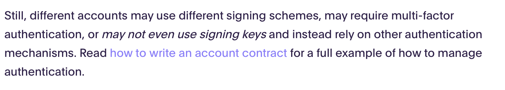

After alpha build 2, I had to implement account contract that took email and password inputs as a start, and subsequently, had to create smart contract like is_valid_impl like this:
https://github.com/joaolago1113/aztec_wallet/blob/main/src/contracts/src/main.nr#L62

#[aztec(noinitcheck)]
    #[contract_library_method]
    fn is_valid_impl(context: &mut PrivateContext, outer_hash: Field) -> bool {
        // Load storage
        let storage = Storage::init(context);

        // Load public key from storage
        let public_key = storage.public_key.get_note();

        // Load hotp_secret note
        let mut hotp_secret = storage.hotp_secret.get_note().note;

        // Load auth witness
        let witness: [Field; 68] = unsafe { get_auth_witness(outer_hash) };
        let mut signature: [u8; 64] = [0; 64];
        for i in 0..64 {
            signature[i] = witness[i] as u8;
        }

        // Verify payload signature using Ethereum's signing scheme
        let outer_hash_bytes: [u8; 32] = outer_hash.to_be_bytes();
        let hashed_message: [u8; 32] = std::hash::sha256(outer_hash_bytes);
        let verification = std::ecdsa_secp256k1::verify_signature(
            public_key.x,
            public_key.y,
            signature,
            hashed_message,
        );

        assert(verification == true, "Invalid ECDSA signature");

        // Extract HOTP code from the witness
        let hotp_code = (witness[67] as u32)
            | ((witness[66] as u32) << 8)
            | ((witness[65] as u32) << 16)
            | ((witness[64] as u32) << 24);

        let hotp_secret_bytes: [u8; 20] = hotp_secret.value.to_be_bytes();

        // Generate valid HOTP codes for counter -1, counter, counter +1
        let mut code_valid = false;

        // Handle potential underflow when subtracting 1 from the counter
        let mut counters_to_try: [Field; 3] = [0; 3];
        
        if ((hotp_secret.counter as u8) > 0) {

            counters_to_try =
            [
                hotp_secret.counter,
                hotp_secret.counter - 1,
                hotp_secret.counter + 1,
            ];
        } else {
            counters_to_try = [hotp_secret.counter, hotp_secret.counter + 1, hotp_secret.counter + 2];
        };

        let mut valid_code = generate_hotp_code(hotp_secret_bytes, counters_to_try[0] as u64);

        if hotp_code == valid_code {
            code_valid = true;
        }else{
            valid_code = generate_hotp_code(hotp_secret_bytes, counters_to_try[1] as u64);

            if hotp_code == valid_code {
                code_valid = true;
            }else{
                valid_code = generate_hotp_code(hotp_secret_bytes, counters_to_try[2] as u64);

                if hotp_code == valid_code {
                    code_valid = true;
                }
            }
        }

        assert(code_valid == true, "Invalid HOTP code");

        // Update the counter to the accepted counter + 1
        hotp_secret.counter += 1;

        // Replace the hotp_secret note with the updated counter
        let this = context.this_address();
        let this_keys = get_current_public_keys(context, this);

        storage.hotp_secret
            .replace(&mut hotp_secret)
            .emit(encode_and_encrypt_note_with_keys(
                context,
                this_keys.ovpk_m,
                this_keys.ivpk_m,
                this,
            ));

        true
    }

    I did not understand head or tail of this code. I could not start thinking about an account contract with email and password as encryption and signing secrets. 

    I tried to collect from aztec chat AI the account contract code with the above prompt (namely email and password as encryption and signing secrets). It gave me this below:
    My prompt to Aztec chat AI:
    I want to create an account contract that makes use of the aztec schnorr contract. it takes 2 private inputs, namely 2 strings s1 and s2. it hashes using sha256, (s1+s2) and uses it as secret key. it hashes using sha256, s2 and uses it as signing key It passes these two keys and salt=0 to a schnorr account object to create a schnorr account. it retains all other features and functions of the schnorr account How do I create this account contract?
    (why did I ask for schnorr account with 2 string inputs hashed as secret key and signing key?)
    I was able to get the account contract code from the above prompt. Aztec chat AI returned this code below:
    
    use dep::aztec::macros::aztec;

#[aztec]
contract CustomSchnorrAccount {
    use dep::authwit::{
        account::AccountActions,
        auth_witness::get_auth_witness,
        entrypoint::{app::AppPayload, fee::FeePayload},
    };
    use dep::aztec::prelude::PrivateContext;
    use dep::aztec::macros::functions::{private, view};
    use dep::std::hash::sha256;

    global public_key_x: Field;
    global public_key_y: Field;

    #[private]
    fn entrypoint(app_payload: AppPayload, fee_payload: FeePayload, cancellable: bool) {
        let actions = AccountActions::init(&mut context, is_valid_impl);
        actions.entrypoint(app_payload, fee_payload, cancellable);
    }

    #[contract_library_method]
    fn is_valid_impl(_context: &mut PrivateContext, outer_hash: Field) -> bool {
        let witness: [Field; 64] = unsafe { get_auth_witness(outer_hash) };
        let mut signature: [u8; 64] = [0; 64];
        for i in 0..64 {
            signature[i] = witness[i] as u8;
        }
        std::schnorr::verify_signature(
            public_key_x,
            public_key_y,
            signature,
            outer_hash.to_be_bytes::<32>(),
        )
    }

    #[private]
    fn setup_keys(s1: String, s2: String) {
        let secret_key = sha256(s1 + s2);
        let signing_key = sha256(s2);
        // Use secret_key and signing_key to set up your Schnorr account
    }
}

it said to include these Nargo.toml dependencies:
[dependencies]
aztec = { git="https://github.com/AztecProtocol/aztec-packages/", tag="aztec-packages-v0.61.0", directory="noir-projects/aztec-nr/aztec" }
authwit = { git="https://github.com/AztecProtocol/aztec-packages/", tag="aztec-packages-v0.61.0", directory="noir-projects/aztec-nr/authwit" }

8 days later, this is my new prompt to Aztec docs chat AI:
I want to create an account contract that makes use of the aztec schnorr contract. it takes 2 private inputs, namely 2 strings s1 and s2. it hashes using sha256, (s1+s2) and uses it as secret key. it hashes using sha256, s2 and uses it as signing key It passes these two keys and salt=0 to a schnorr account object to create a schnorr account. it retains all other features and functions of the schnorr account How do I create this account contract?
Aztec docs chat returned me this contract code:

// Account contract that uses Schnorr signatures for authentication using a hardcoded public key.
use dep::aztec::macros::aztec;

#[aztec]
contract SchnorrHardcodedAccount {
    use dep::authwit::{
        account::AccountActions,
        auth_witness::get_auth_witness,
        entrypoint::{app::AppPayload, fee::FeePayload},
    };
    use dep::aztec::prelude::PrivateContext;
    use dep::aztec::macros::functions::{private, view};

    global public_key_x: Field = 0x16b93f4afae55cab8507baeb8e7ab4de80f5ab1e9e1f5149bf8cd0d375451d90;
    global public_key_y: Field = 0x208d44b36eb6e73b254921134d002da1a90b41131024e3b1d721259182106205;

    #[private]
    fn entrypoint(app_payload: AppPayload, fee_payload: FeePayload, cancellable: bool) {
        let actions = AccountActions::init(&mut context, is_valid_impl);
        actions.entrypoint(app_payload, fee_payload, cancellable);
    }

    #[private]
    #[view]
    fn verify_private_authwit(inner_hash: Field) -> Field {
        let actions = AccountActions::init(&mut context, is_valid_impl);
        actions.verify_private_authwit(inner_hash)
    }

    #[contract_library_method]
    fn is_valid_impl(_context: &mut PrivateContext, outer_hash: Field) -> bool {
        // Load auth witness and format as an u8 array
        let witness: [Field; 64] = unsafe { get_auth_witness(outer_hash) };
        let mut signature: [u8; 64] = [0; 64];
        for i in 0..64 {
            signature[i] = witness[i] as u8;
        }
        // Verify signature using hardcoded public key
        std::schnorr::verify_signature(
            public_key_x,
            public_key_y,
            signature,
            outer_hash.to_be_bytes::<32>(),
        )
    }
}

and says modify above to get your email and password as encryption and signing secrets.

this is schnorr signature algorithm as per claude ai: https://claude.ai/chat/f3320546-e93b-45a5-9e38-98ca15dd1a31

Claude gives me simplest authentication payload for an account. that hopefully i can use for aztec.
https://claude.ai/chat/99d2e66d-234c-4761-9797-fde6731f7159

the abstract of account contract in aztec in pseudocode:
publicKey: PublicKey;

def entryPoint(payload):
    let { privateCalls, publicCalls, nonce, signature } = payload;
    let payloadHash = hash(privateCalls, publicCalls, nonce);
    validateSignature(this.publicKey, signature, payloadHash);

    foreach privateCall in privateCalls:
        let { to, data, value } = privateCall;
        call(to, data, value);

    foreach publicCall in publicCalls:
        let { to, data, value, gasLimit } = publicCall;
        enqueueCall(to, data, value, gasLimit);

username password rsa public key/private key as what secures the account.
authentication by username and password
signing of message- the user payload- is via rsa signature.
this is the local python file containing the code, python notebook. http://localhost:8888/notebooks/simplest%20auth%20scheme.ipynb
beautiful claude thread which is the source. https://claude.ai/chat/99d2e66d-234c-4761-9797-fde6731f7159

import hashlib
import os
from cryptography.hazmat.primitives import hashes
from cryptography.hazmat.primitives.asymmetric import rsa, padding

class SimpleAuthWithSign:
    def __init__(self):
        self.users = {}  # username -> (salt, hashed_password, private_key)
        self.public_keys = {}  # username -> public_key
    
    def register(self, username, password):
        """Register a new user"""
        # Password handling
        salt = os.urandom(16).hex()
        hashed = hashlib.sha256((password + salt).encode()).hexdigest()
        
        # Generate RSA keys
        private_key = rsa.generate_private_key(
            public_exponent=65537,  # Standard RSA exponent
            key_size=2048          # Key size in bits
        )
        public_key = private_key.public_key()
        
        self.users[username] = (salt, hashed, private_key)
        self.public_keys[username] = public_key
        return True
    
    def authenticate(self, username, password):
        """Check if username/password is valid"""
        if username not in self.users:
            return False
        
        salt, stored_hash, _ = self.users[username]
        attempt_hash = hashlib.sha256((password + salt).encode()).hexdigest()
        return attempt_hash == stored_hash
    
    def sign_message(self, username, password, message):
        """Sign a message if credentials are valid"""
        if not self.authenticate(username, password):
            return None
        
        _, _, private_key = self.users[username]
        
        # PSS padding with MGF1 is the standard way to safely sign with RSA
        # It's like adding salt to a password - it makes the signature secure
        padding_algorithm = padding.PSS(
            mgf=padding.MGF1(hashes.SHA256()),  # Standard mask generation function
            salt_length=padding.PSS.MAX_LENGTH   # Use maximum salt length for security
        )
        
        signature = private_key.sign(
            message.encode(),
            padding_algorithm,
            hashes.SHA256()  # Hash algorithm for the message
        )
        return signature
    
    def verify_signature(self, username, message, signature):
        """Verify a message signature"""
        if username not in self.public_keys:
            return False
            
        try:
            # Must use same padding settings for verification
            padding_algorithm = padding.PSS(
                mgf=padding.MGF1(hashes.SHA256()),
                salt_length=padding.PSS.MAX_LENGTH
            )
            
            self.public_keys[username].verify(
                signature,
                message.encode(),
                padding_algorithm,
                hashes.SHA256()
            )
            return True
        except:
            return False

# Example usage
auth = SimpleAuthWithSign()

# Register a user
auth.register("alice", "pass123")

# Sign a message
message = "Hello, this is Alice!"
signature = auth.sign_message("alice", "pass123", message)

# Verify the signature
is_valid = auth.verify_signature("alice", message, signature)
print(f"Signature valid: {is_valid}")  # True

# Try with wrong password
bad_sig = auth.sign_message("alice", "wrongpass", message)
print(f"Sign with wrong password: {bad_sig is None}")  # True

It seems from reading the document, especially pseudocode for account contract here, https://docs.aztec.network/aztec/concepts/accounts, that the entrypoint does not take user authentication, it is just about payload signing, using the signing keys. This should work it seems.

Explore these as exception account contract calls:
1. Non contract account test. https://github.com/AztecProtocol/aztec-packages/blob/master/yarn-project/end-to-end/src/e2e_non_contract_account.test.ts
2. Signerless wallet. https://github.com/AztecProtocol/aztec-packages/blob/master/yarn-project/end-to-end/src/e2e_non_contract_account.test.ts

You may or may not use signing keys in account contract [google eyes]

how to store signing keys (if at all)  and 
how complete address is deterministically derived: 
partial_address := poseidon2("az_contract_partial_address_v1", contract_class_id, salted_initialization_hash)
public_keys_hash := poseidon2("az_public_keys_hash", Npk_m, Ivpk_m, Ovpk_m, Tpk_m)
address := poseidon2("az_contract_address_v1", public_keys_hash, partial_address)
all the types of necessary keys:  can be determined to be for a complete address.
transaction execution-  
https://raw.githubusercontent.com/AztecProtocol/aztec-packages/835b87ead8e031ea78952f75c61b0526da290f54/docs/static/img/sandbox_sending_a_tx.png 
detailed: contract deployment, private execution (transaction?) and public transactions- 
https://raw.githubusercontent.com/AztecProtocol/aztec-packages/2fa143e4d88b3089ebbe2a9e53645edf66157dc8/docs/static/img/sandbox_sending_a_tx.svg
